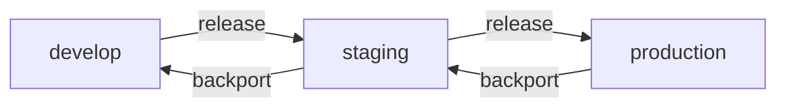
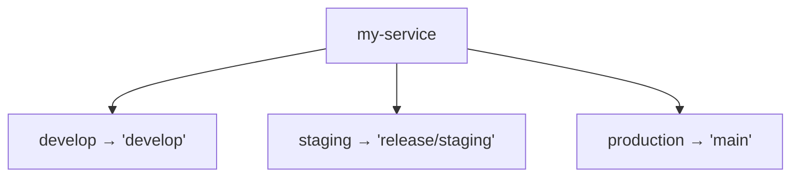
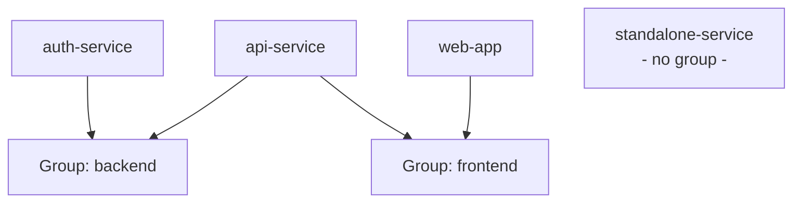

# husgit-cli

A CLI tool for orchestrating GitLab merge request workflows across multiple projects.

Automates environment promotion (release) and demotion (backport) by creating and updating MRs via the GitLab API — across all projects in a group simultaneously.

## Prerequisites

- Node.js 18+
- A [GitLab personal access token](https://docs.gitlab.com/ee/user/profile/personal_access_tokens.html) with `api` scope

## Installation

```bash
npm install -g husgit-cli
```

## Setup

**1. Set your GitLab token:**

```bash
export GITLAB_TOKEN=your_token_here
```

Add this to your shell profile (`~/.zshrc`, `~/.bashrc`) to make it permanent.

**2. Configure your environment chain:**

```bash
husgit setup flow
```

This walks you through defining your environments in order (e.g., `develop → staging → production`) and saves them to `~/.husgit/config.json`.

**3. Create a project group and add projects:**

```bash
husgit group add my-services
husgit group add-project
```

`add-project` searches your GitLab namespace, lets you select one or more projects, and optionally maps each environment to a branch. Both the group assignment and per-environment branch mapping are optional — you can skip any environment you don't need. Pass a group name as an argument to pre-assign all selected projects to that group:

```bash
husgit group add-project my-services
```

## Auto-Update

husgit automatically checks for available updates when you run commands. If a newer version is available, you'll be prompted to install it.

### Skipping Update Checks

To skip the update check for a single run:

```bash
husgit --skip-update-check <command>
```

To disable update checks entirely, set the environment variable:

```bash
export HUSGIT_SKIP_UPDATE_CHECK=1
husgit <command>
```

Update checks are cached for 8 hours to minimize startup overhead. The cache is stored in `~/.husgit/version-cache.json`.

## Concepts

### Environment Flow

Environments form a linear chain. `release` promotes forward, `backport` demotes backward:



### branchMap: Project → Branch per Environment

Each project maps every environment to its corresponding branch:



### Groups as Optional Labels

Projects live in a flat registry. Groups are optional labels you can assign projects to — and a project can belong to multiple groups:



## Usage

**Promote projects to the next environment:**

```bash
husgit release staging
```

Creates (or updates) MRs from each project's `staging` branch to `production`. Without flags, prompts you to select which projects to include. Use flags to skip the interactive selection:

```bash
husgit release staging --group my-services   # target a specific group
husgit release staging --all                 # target all projects
husgit release staging --dry-run             # preview without creating MRs
```

**Demote to a previous environment:**

```bash
husgit backport staging
```

Creates MRs from each project's `staging` branch back to `develop` (the previous environment). Supports the same flags as `release`:

```bash
husgit backport staging --group my-services
husgit backport staging --all
husgit backport staging --dry-run
```

**Check MR status between environments:**

```bash
husgit status release develop
husgit status backport staging --group my-services
husgit status release develop --hide-empty   # omit MRs with no diff
```

Shows MRs for the given direction and source environment. For each project:
- If an **open** MR exists, it is shown with its current CI pipeline status (`headPipeline`)
- If no open MR exists, the **most recent merged** MR is shown as a fallback with its post-merge pipeline status

The state column indicates whether the MR has actual changes or is empty (branches already in sync). Use `--hide-empty` to suppress MRs where the source and target branches are already in sync (`hasChanges = false`). The pipeline column shows overall status (`passed`, `failed`, `running`, etc.) with additional context — failing job names for failures, stage names for running/pending/canceled pipelines.

After running `release` or `backport`, the CLI will suggest the matching `status` command to track your MRs.

**Interactive mode (no arguments):**

```bash
husgit
```

## Commands

| Command | Description |
|---------|-------------|
| `husgit` | Launch interactive menu |
| `husgit setup flow` | Configure environment chain |
| `husgit group add <name>` | Create a new group |
| `husgit group add-project [group]` | Add one or more projects (optionally assign to a group) |
| `husgit group list` | List all groups and their projects |
| `husgit group remove <name>` | Remove a group |
| `husgit project add` | Add a project to the registry (alias for `group add-project`) |
| `husgit project list` | List all projects in the registry |
| `husgit project remove [fullPath]` | Remove a project from the registry and all groups |
| `husgit release [source-env]` | Promote projects to the next environment |
| `husgit backport [source-env]` | Demote projects to the previous environment |
| `husgit status <type> <source-env> [--group <name>] [--hide-empty]` | Show MRs (open, or most recent merged as fallback) with pipeline status |
| `husgit config export` | Copy config to clipboard for sharing |
| `husgit config set <file>` | Load config from a JSON file (backs up current config) |

## Environment Variables

| Variable | Required | Default | Description |
|----------|----------|---------|-------------|
| `GITLAB_TOKEN` | Yes | — | GitLab personal access token with `api` scope |
| `GITLAB_URL` | No | `https://gitlab.com` | GitLab instance URL (for self-hosted) |

## Config

Configuration is stored at `~/.husgit/config.json`. You can edit it directly or use the CLI commands to manage it.

## Development

**Prerequisites:** Node.js >= 18, [pnpm](https://pnpm.io/)

```bash
git clone https://github.com/SevrainChea/husgit-cli.git
cd husgit-cli
pnpm install
```

**Build once:**

```bash
pnpm build        # outputs to dist/index.js
pnpm typecheck    # TypeScript type checking
pnpm format       # Prettier formatting
pnpm test         # run tests
```

**Watch mode (rebuilds on save):**

```bash
pnpm dev
```

`pnpm dev` runs tsup in watch mode — it recompiles `src/` into `dist/index.js` on every file save. There's no live-reload; to test a change, run the CLI manually in a second terminal after saving:

```bash
# Terminal 1
pnpm dev

# Terminal 2 — re-run after each save
./dist/index.js <command>
```

**Link globally for local testing:**

```bash
pnpm link --global   # makes `husgit` available system-wide
# ... make changes, then rebuild with pnpm build or pnpm dev
pnpm unlink --global # remove when done
```

The global `husgit` binary points to `dist/index.js`, so changes require a rebuild to take effect.

**Local config for testing:**

Edit `~/.husgit/config.json` directly to set up test environments and groups without affecting real GitLab projects. The file is created automatically on first run.

## Publishing

### Version Management

Versions are managed manually using npm's versioning system. Before each release, decide whether the change is a:

- **Patch** (`0.0.X`) — Bug fixes and small improvements
- **Minor** (`0.X.0`) — New features, backwards compatible
- **Major** (`X.0.0`) — Breaking changes

### Release Process

Use the automated release script to bump version, run checks, and publish:

```bash
# Preview what will be published (dry run)
pnpm release:dry patch

# Actually publish (bumps version, creates git tag, publishes to npm)
pnpm release patch
pnpm release minor
pnpm release major
```

The release script automatically:
1. Type checks your code (`tsc --noEmit`)
2. Verifies formatting with Prettier
3. Builds the package (`tsup`)
4. Bumps the version using `npm version` (creates git tag)
5. Publishes to npm registry

If any check fails, the release stops immediately and nothing is published.

### Manual Release (if needed)

For advanced scenarios, you can manage versioning manually:

```bash
npm version patch    # or minor, major
npm publish
```

## License

MIT
